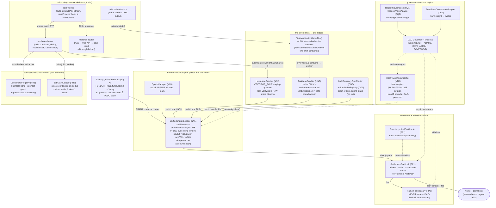
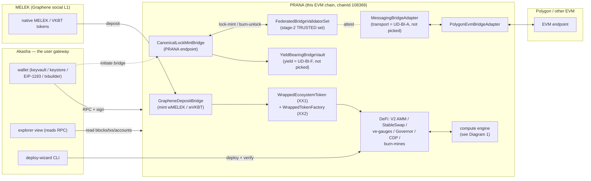

# PRANA — Engine Diagrams (ZZ2-2)

> The "chain IS the pool" compute engine and the bridge/wallet/ecosystem layer, drawn with
> the **real contract names** from `contracts/contracts/compute/` and `…/bridge/`. Mermaid
> first; an ASCII recap of the closed loop follows for clarity.

---

## Diagram 1 — The chain-as-pool compute engine

How a **HASH** share, a **TASK** share, and a **BURN** all flow into one
`UnifiedSharesLedger`, how PPLNS pays out, where the fee + treasury sit, and how the
off-chain worker→coordinator→on-chain loop closes through the permissionless coordinator gate.



**Read it as:** the worker is *indifferent* to lane (equal weight = seamless switching). HASH
flows straight in (self-verifying, replay-guarded). TASK must pass the K-of-N verification gate
before its creditor will mint a share, and the recipient is pinned by the gate — a coordinator
cannot redirect credit. BURN is a permanent stake lane. All three become `poolShares` in the
**single** `UnifiedSharesLedger`, paid PPLNS from a funded issuance budget. Every payout passes
through `SettlementFeeHook` on-chain, so the Hathor skim is identical for every coordinator and
cannot be dodged by any front-end; the skim lands in a treasury that never trades and only the
DAO timelock can drain.

---

## Diagram 2 — Bridge / wallet / ecosystem layer

How value and identity move between MELEK (Graphene social chain), PRANA (this EVM chain), and
Polygon, and where the Akasha wallet/explorer sits as the single user gateway.



**Read it as:** MELEK tokens reach PRANA's DeFi as wrapped/pegged assets via
`GrapheneDepositBridge`; cross-EVM movement goes through `CanonicalLockMintBridge` gated by a
**trusted (stage-2)** validator set over a pluggable messaging transport. Akasha is the one
branded front-end (wallet + explorer + deploy-wizard) users touch; it talks to PRANA over RPC
and can initiate a bridge. **Stage-3** (fully audited, two-way) is still to build; the messaging
protocol, Polygon connectivity, and vault-yield toggles are open **UD-BI** decisions.

---

## ASCII recap — the closed loop (one glance)

```
  worker ──shares──▶ coordinator ──(bonded? CoordinatorRegistry)──┐
    │                    │                                        │
    │                    ├──HASH──────────────▶ HashLaneCreditor ─┤
    │                    │                                        ▼
    └──TASK──▶ inference  └──TASK claim──▶ TaskVerificationGate ──▶ TaskLaneCreditor
                router          (K-of-N staked attestors)                │
                                                                         ▼
   BURN ▶ MultiCurrencyBurnRouter ───────────────────────────▶  UnifiedSharesLedger
                                                  (poolShares × laneWeight, PPLNS)
   funding (fundEpoch ✅ / coinbase-hook ⏳) ───────────────────────────▲
                                                                         │
                              claim(epoch) ──▶ SettlementFeeHook ──┬─fee─▶ HathorFeeTreasury
                                                                   └─net──▶ worker payout addr
```

The loop is closed: off-chain work becomes on-chain shares only through a gated, verified,
deduped path; the chain itself pays the worker; the protocol fee is taken at the one on-chain
chokepoint that no front-end can bypass.
